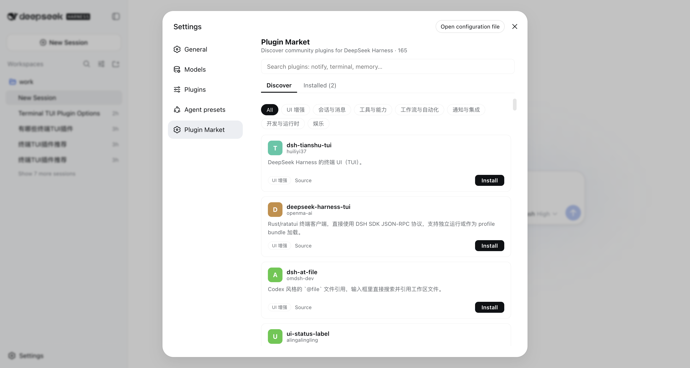

# dsh-market

English | [中文](README.zh.md)

The plugin market inside DeepSeek Harness. Open Settings → **Plugin Market** → browse, search, one-click install.



## Install

```sh
dsh plugin --profile web add dsh-market
```

Restart `dsh web`, then open **Settings → Plugin Market**.

## What you get

- **Discover** — the full community catalog (165+ plugins, growing daily), searchable, filterable by category, with bilingual descriptions
- **One-click install** — confirm the source, click install, restart when prompted. No terminal needed
- **Installed** — see every community plugin in your profile at a glance

## Security

- Installs are restricted to sources listed in the curated [awesome-dsh-plugin](https://awesome-dsh-plugin.com) registry — the install route rejects anything else
- Build scripts are blocked by default (pnpm ≥10); enabling one is your explicit, per-package choice
- The install endpoint accepts same-origin POST only
- Listing ≠ endorsement: plugins are third-party code, install sources you trust

## Data source

Live from [awesome-dsh-plugin.com/plugins.json](https://awesome-dsh-plugin.com/plugins.json) (CI-updated on every registry merge), with a bundled snapshot as offline fallback.

## Roadmap

Theme store tab (instant hot-switch), update detection, uninstall/toggle, more entry points.

## License

MIT · [dshmarket.com](https://dshmarket.com)
